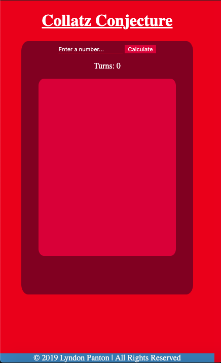
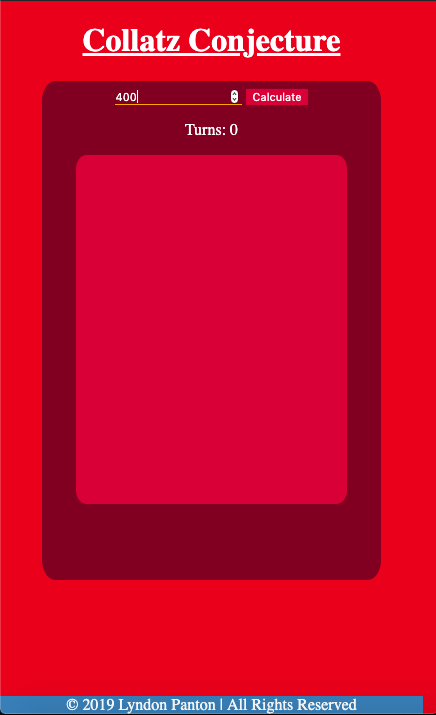
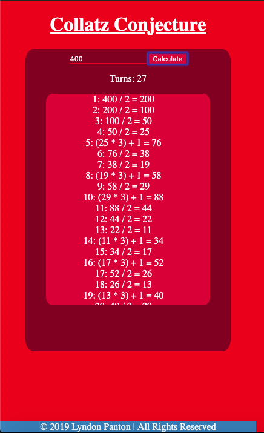
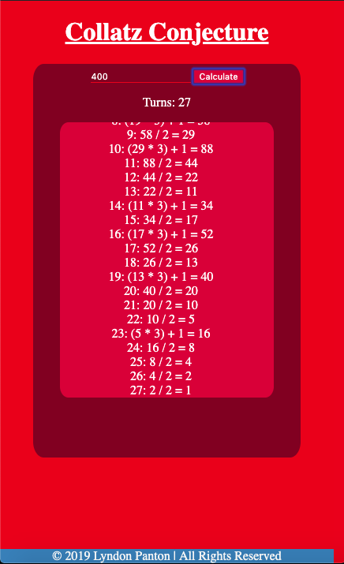

# Collatz Conjecture

### How To Open 
> 1. Go to the folder the project was downloaded in
> 2. Right click on the file name _index.html_
> 3. Choose the _open with_ option
> 4. Open the appliation in a browser of your choice

### How To Use
> 1. Enter a number in the text input field
> 2. Press the calculation button to apply the Collatz Conjecture to it
> 3. The application will tell you how many turns it took and display the calculations it made

### Requirements
- This project requires a browser to run
- The browser must have Javascript available and enabled

### Preview

